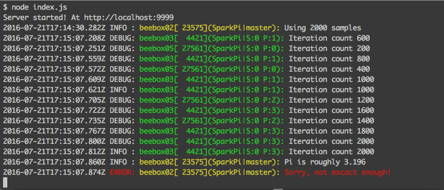

## Overview

Running Spark in yarn mode means that log files with debug info is distributed across the nodes that yarn has decided to provide for the job's driver and executors. The project tries to provide a quick and holistic view on the application specific debugging info (especially for streaming) without digging into the details of log4j. 

**Note:** This not meant as a replacement for log4j and in enterprise environments tweaking log4j and using the existing YARN and Spark tools is the way to go. However during development and testing it can be quite convenient and can be easily replaced again with log4j by changing the logger intializations.


## Using LogOverHttp

### Compile LogOverHttp

Quickest way is to use sbt to publish the project to the local ~/.ivy2 folder

```bash
$ sbt publish-local
```

### Add dependency

Edit `build.sbt` and add 

```scala
"com.betaocean" % "logoverhttp_2.10" % "1.0.0"
```

as a dependency


### Use LogOverHttp in Spark applications

1) Import it

	import com.betaocean.LogOverHttp.LogOverHttp

Since Spark differentiates between driver and executors two different loggers are recommended

a) For all code that runs on the master (ensure name of the logger ends with "master")

```scala
object MyCoolSparkProject {

	val logger = new LogOverHttp("MyCoolSparkProject|master")
	...
}
```

b) For all code that runs on executors add Spark's stage id and partition id

```bash
val taskContext = org.apache.spark.TaskContext.get
val logger2 = new LogOverHttp(s"MyCoolSparkProject|S:${taskContext.stageId} P:${taskContext.partitionId}")
```

2) Use

```scala
// master
logger.info("Some intelligent message")
logger.error("Some intelligent message")

// executors
logger2.debug("Some intelligent distributed message")
```


### Start log server

```bash
$ cd server
$ npm install
$ node index.js
```

### Start the Spark job
	
```bash
$ sbt assembly

$ EXECUTOR_DEBUG=beebox02:9999:debug
$ DRIVER_DEBUG=beebox02:9999:debug

$ spark-submit --master yarn --deploy-mode client \
		       --conf="spark.driver.extraJavaOptions=-Dhttpdebug=$DRIVER_DEBUG" \
		       --conf="spark.executor.extraJavaOptions=-Dhttpdebug=$EXECUTOR_DEBUG" \
               --class SparkPi target/scala-2.10/MyCoolSparkProject-assembly-1.0.jar $@
```

The debug level can be set independently for driver and executors. The format is `<host>:<port>:<debug-level>` where `host` and `port` identify the address of the LogOverHttp server runs and `debug-level` can be `debug`, `info` or `error`.

LogOverHttp uses HTTP POST to send json events of the form

```json
{"time":1469117542306, "type":"INFO", "host":"beebox02.localdomain","pid":15639, "tid":"SparkPi:master", "message":"Hallo"}
```

the webserver listening on `<host>:<port>:`. At the same time logs the message into default log files of Spark.


## Example

The code (`test/spark-pi/src/main/scala/SparkPi.scala`):

```scala
import org.apache.spark.SparkConf
import org.apache.spark.SparkContext
import org.apache.spark.SparkContext._

import com.betaocean.LogOverHttp.LogOverHttp

object SparkPi {
  val logger = new LogOverHttp("SparkPi|master")

  // This routine runs on Spark Executors, so define own logger with Spark stage/partition info
  def sample(p: Int) = {
    val taskContext = org.apache.spark.TaskContext.get
    val logger2 = new LogOverHttp(s"SparkPi|S:${taskContext.stageId} P:${taskContext.partitionId}")

    val x = Math.random()
    val y = Math.random()

    if (p % 200 == 0) logger2.debug(s"Iteration count ${p}")
    if (p % 1000 == 0) logger2.info(s"Iteration count ${p}")

    if (x*x + y*y < 1) 1 else 0
  }

  def main(args: Array[String]) = {
    val NUM_SAMPLES = args(0).toInt 
    logger.info(s"Using ${NUM_SAMPLES} samples")

    var conf = new SparkConf().setAppName("spark-pi")
    val sc = new SparkContext(conf)

    val count = sc.parallelize(1 to NUM_SAMPLES, 4).map{i => sample(i)}.reduce(_ + _)
    val piEstimate = 4.0 * count / NUM_SAMPLES
    
    logger.info(s"Pi is roughly ${piEstimate}")
    if (scala.math.abs(scala.math.Pi - piEstimate )> 0.000000001)
      logger.error("Sorry, not excact enough!")
  }
}

```

Compile it

```bash
$ cd ./test/spark-pi
$ sbt assembly
```

Start log web server

```bash
$ cd ./server
$ npm install
$ node index.js
```


Adapt host and port for `EXECUTOR_DEBUG` and `DRIVER_DEBUG` in `runs.sh` and run it:

```bash
$ ./runs.sh 2000
```

After some time the log server will show the following output: 




The number in `[]` is the process id (pid). There is one driver, two executors and one stage with 4 RDD partitions.
